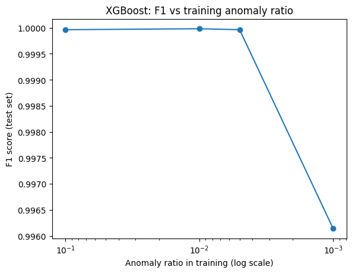

# Latent Behavioural Anomaly Detection
PhD preparation research project – Cybersecurity & Machine Learning 

## Research Motivation

Supervised intrusion detection models degrade significantly under extreme class imbalance and distribution drift. 
This project investigates whether modelling behavioural regime transitions in latent space provides improved robustness and earlier detection compared to traditional per-flow classification.


This repository investigates intrusion detection under:
- Extreme class imbalance (<0.1% anomalies)
- Behavioural drift
- Early detection requirements

The project formulates intrusion detection as behavioural regime change detection in latent space rather than per-flow classification.


## Dataset

Primary dataset:
CIC-IDS2017

See `data/README.md` for download and preprocessing instructions.


## Installation

Clone the repository:

```bash
git clone https://github.com/akmnurlan/latent-behavioural-anomaly-detection.git
cd latent-behavioural-anomaly-detection
```

Create a virtual environment (recommended):
```bash
python -m venv venv
source venv/bin/activate        # macOS / Linux
venv\Scripts\activate           # Windows
```
Install dependencies:
```bash
pip install -r requirements.txt
```
Verify installation:
```bash
python -c "import torch, sklearn, xgboost; print('Environment ready')"
```

## Running Baseline Experiment

Example: XGBoost baseline

```bash
python -m src.models.xgb --config configs/xgb.yaml
```
Autoencoder:
```bash
python -m src.models.autoencoder --config configs/autoencoder.yaml
```
Latent change detection:
```bash
python -m src.models.changepoint --config configs/changepoint.yaml
```

## Preliminary Baseline Result

**XGBoost baseline:** F1 performance drops sharply as labelled anomalies become extremely rare in training data.



## Models

### Baseline 1 – Supervised
- XGBoost classifier
- Performance evaluated under simulated imbalance (1%, 0.5%, 0.1%)

### Baseline 2 – Unsupervised
- Autoencoder trained on normal traffic only
- Reconstruction error thresholding

### Proposed Method
- Latent representation learning
- Change-point detection (CUSUM / rolling window)
- Detection delay evaluation


## Evaluation Metrics
- Precision
- Recall
- F1-score
- False Positive Rate (FPR)
- Detection Delay


## Reproducibility
- Configuration-driven experiments (`configs/`)
- Fixed random seeds
- Results exported to `results/`


## Repository Structure
- `src/` core implementation
- `configs/` experiment settings
- `notebooks/` exploratory analysis
- `results/` figures and tables
- `reports/` technical documentation


## Status (Feb–Apr 2026)
- Data preprocessing
- Baseline model implementation
- Latent change detection development
- Technical report preparation


